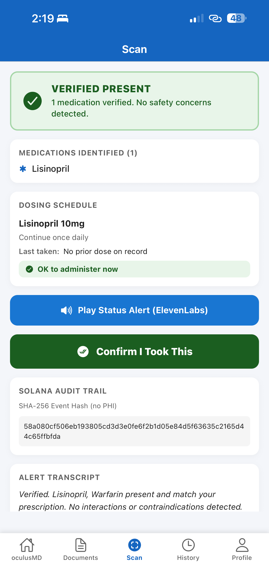
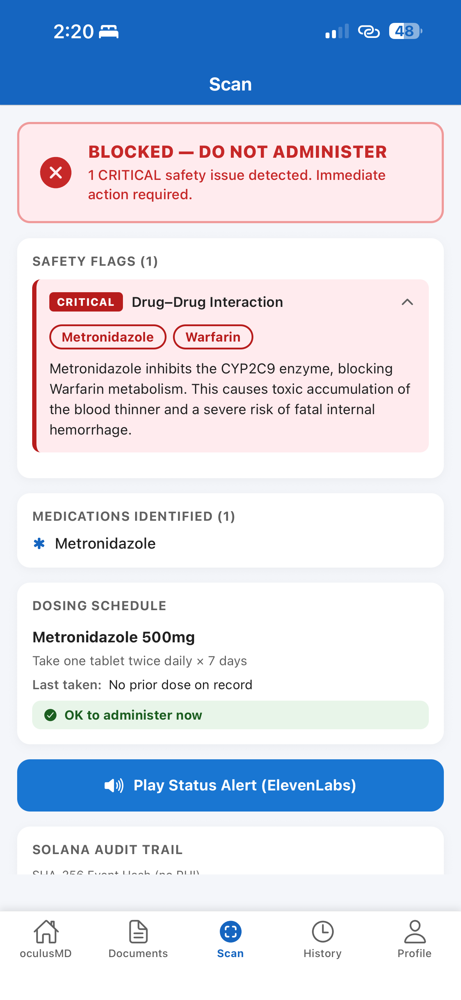

# OculusMD — Assisted Medication Safety

> **Built at QuackHacks 2026** · Hackathon Project

---

## Our Goal: 66% to 0% Medicine-Related Complications

Every year, **20% of discharged patients suffer complications within 30 days** of leaving the hospital, and **66% of those complications are caused by medication errors** (New England Journal of Medicine).

Patients go home alone with discharge paperwork listing multiple new medictions, often prescribed by different providers who are not in contact with each other. A cardiologist prescribes a blood thinner. A dentist, unaware, prescribes an antibiotic. The patient, not a medical professional, has no way of knowing those two drugs together can cause fatal internal hemorrhage.

Consumer health apps offer reminders and logs. **None of them physically verify what is in the patient's hand**, cross-reference it against their full medical history, and stop them before they take something dangerous.

**OculusMD does.**

---

## What It Does

OculusMD is an **AI-powered medication safety copilot** that monitors medication routines and guides proper consumption on the patient's behalf.

The patient scans their pill tray with their phone camera. In seconds:

- **Computer vision** detects and counts physical objects on the tray
- **Gemini 2.5 Flash** reads labels and extracts medication names from discharge paperwork
- **A deterministic safety engine** cross-references every drug against a medical database, checking for dangerous interactions, contraindications, and double-dose timing violations
- **ElevenLabs TTS** speaks the verdict out loud in plain language the patient can actually understand
- **Solana blockchain** writes a tamper-evident hash of the event as a permanent, uneditable audit record

If anything is wrong, the system **blocks the dose and explains exactly why**. If everything is clear, the patient gets a spoken confirmation and can proceed safely.

---

## Social Impact

Medication errors are the **leading preventable cause of harm** in post-discharge care, disproportionately affecting elderly patients, low-health-literacy populations, and anyone managing multiple chronic conditions at home.

OculusMD's mission is to close the gap between hospital-grade medication oversight and at-home care by making a **physical-digital safety check accessible to every patient with a smartphone**.

| Impact Area | Current State | OculusMD Goal |
|---|---|---|
| Post-discharge complications | 20% of patients within 30 days | Significantly reduced |
| Medication error rate | 66% of complications | Driven toward 0% |
| Safety oversight | Hospital only | Hospital + Home |
| Patient accessibility | Medical professionals | Anyone with a smartphone |

---

## Demo Scenarios

All scenarios use demo patient **Marcus Vance**, a 68-year-old male discharged after a DVT (blood clot) diagnosis, with pre-existing hypertension.

**Demo 1 — Contraindication**
Marcus reaches for Sudafed for a cold.
Result: BLOCKED — Pseudoephedrine is a vasoconstrictor. In severe hypertension it can trigger a hypertensive crisis, risking stroke or myocardial infarction.

**Demo 2 — Lethal Drug Interaction**
Marcus is on Warfarin (blood thinner). His dentist prescribed Metronidazole for an abscess.
Result: BLOCKED (Critical) — Metronidazole inhibits the CYP2C9 enzyme, blocking Warfarin metabolism and causing toxic accumulation with severe risk of fatal internal hemorrhage.

**Demo 3 — Double Dose**
Marcus scans his Warfarin again 47 minutes after already taking a dose.
Result: BLOCKED — A dose was already logged. Minimum re-dose interval is 8 hours.

## Screenshots

> Verified Present — Lisinopril 10mg scan. No safety concerns detected.
>
> 
>
> > Blocked — Critical drug-drug interaction: Metronidazole + Warfarin. Severe risk of fatal internal hemorrhage.
> >
> > 

## How It Works

### Prescription Scan Flow

Phone Camera detects and reads prescription label, then Gemini 2.5 Flash reads label text and reports observations. FastAPI runs the safety engine. MongoDB checks every drug against interactions, contraindications, dose ceilings, and timing. ElevenLabs converts verdict into spoken audio. React Native displays a GREEN/RED/YELLOW banner and plays audio to the patient. Solana Devnet writes the hash of the event as a permanent tamper-evident audit record.

### Patient Q&A Flow

The patient types or asks a question in React Native. FastAPI fetches relevant drug data from MongoDB. MongoDB provides the drug dosage, interaction, and contradiction data to anchor the answer. Gemini answers using the discharge document and MongoDB data, always ending with a provider disclaimer. ElevenLabs displays the answer text and plays audio.

**Core Design Principle:** Gemini *observes* — it reads labels and extracts names. MongoDB *decides* — it owns every safety verdict. These two responsibilities never cross.

---

## Tech Stack

### Backend
- Python 3.14 / FastAPI / Uvicorn
- MongoDB 6.0
- Google Gemini 2.5 Flash
- ElevenLabs Turbo v2.5
- Solana Web3.js / Devnet

### Frontend
- React Native / Expo
- React Navigation

### Data Sources (Data Equity)
- **OpenFDA** — drug interactions, adverse events, labels
- **DrugBank** — full drug profiles including side effects
- **RxNorm** — standardizes drug names (e.g. "Tylenol" to "Acetaminophen")

---

## Safety Guardrails

- **AI never makes safety decisions.** Every block comes from a database row, not a model's judgment.
- **PHI never touches the blockchain.** Solana memos contain only a SHA-256 hash — no drug names, no patient identifiers.
- **Human review is mandatory** when labels are unreadable, identity is uncertain, or any High/Critical flag is raised.
- **Gemini NEVER produces its own medical insights** — all clinical verdicts are anchored to verified data sources.

---

## Running the Project

Install backend dependencies, set up the environment variables (GEMINI_API_KEY, ELEVENLABS_API_KEY, ELEVENLABS_VOICE_ID, SOLANA_PRIVATE_KEY), seed the database with seed_db.py, then start the server with uvicorn main:app --port 8000 --reload.

Run tests with: python -m pytest test_engine.py -v (unit tests, no API keys needed) or python test_static.py (full pipeline test).

---

## API Endpoints

| Endpoint | Description |
|---|---|
| POST /verify | Full scan pipeline — image + clinical text to safety verdict |
| POST /speak | ElevenLabs TTS proxy — text to audio |
| POST /summarize | Discharge document to plain-language spoken summary |
| POST /ask | Patient Q&A — question + document context to spoken answer |
| GET /health | Server + database health check |

---

## Team

Built at **QuackHacks 2026** by [@tuanhoang0117](https://github.com/tuanhoang0117), [@Evan287](https://github.com/Evan287), and contributors.

[View the full pitch deck](https://pitch.com/v/quackhacks-6fkac6)
